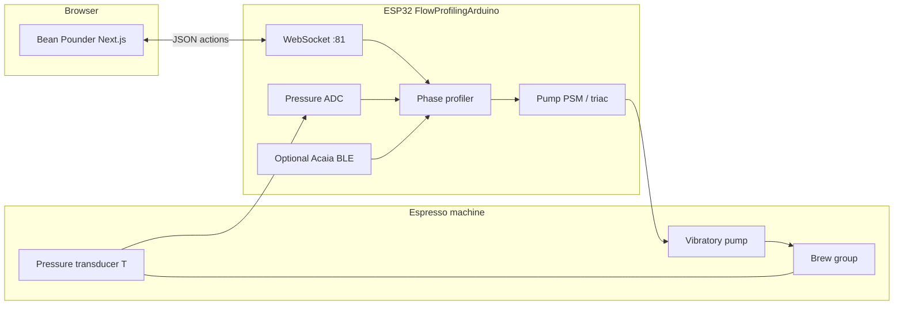

# Elizabeth Central Command / Bean Pounder

## TL;DR

This repo is a **custom espresso control and logging stack** built around:

1. **Firmware (`Firmware/FlowProfilingArduino`)** — An **ESP32** sketch that **uses Gaggiuino’s pump control code** (pressure/flow targeting vs live sensors), **adapted** for **PSM** pump drive on this board; it runs profiles from **JSON shaped like Gaggiuino’s profile schema** and streams **live telemetry over WebSockets** using **the same `action` names and payload shapes** as Gaggiuino’s web UI (`sensor_data_update`, `shot_data_update`, `log_record`, etc.). It is **not** the full Gaggiuino STM32 firmware.

2. **Web app (`WebServer/`)** — A **Next.js** application (**Bean Pounder** in the UI) that talks to the ESP over **WebSocket**, shows **live pressure / pump flow / weight** charts, lets you **pick machine profiles from the device**, **edit profiles**, and tracks **coffees, recipes, and a brew ledger** in a **Postgres** database (Drizzle). This web client is **intentionally temporary**; the **planned primary UI is a native mobile app** (see [Software stack (WebServer)](#software-stack-webserver)).

**Compared to [Gaggiuino](https://github.com/Zer0-bit/gaggiuino):** we **reuse Gaggiuino’s pump control** and match **profile + WebSocket telemetry conventions**; everything else is **separate ESP32 firmware and a different feature set** (see [Relationship to Gaggiuino](#relationship-to-gaggiuino)).

**Plumbing / hydraulics:** On the machine side, the **only extra component you must add in the water path** for closed-loop pressure profiling is a **pressure transducer** (installed on a **T-fitting** or equivalent tap so it sees brew-line pressure). Everything else is **electrical/control** (MCU, pump power control, optional scale, wiring)—important, but not “plumbed in” the same way.

**Install model:** This mod is aimed at **dual-boiler** machines (or similar) whose **brew and steam temperatures are already under PID** (factory or aftermarket). Bean Pounder’s purpose is **only** to add **pump-side pressure/flow profiling** and related telemetry—it does **not** take over boilers, steam, or the rest of the machine’s logic. **Gaggiuino** and **GaggiMate** are **standalone** controller stacks that **replace** the brain of the machine on typical installs; **Bean Pounder is meant to run in parallel** with your **existing** controller so that controller keeps doing PID and system duties while the ESP adds profiling **alongside** it.

---

## Target machines & design intent

| | |
|--|--|
| **Intended hardware context** | **Dual-boiler** (or equivalent) machines with **PID-controlled** brew path—and usually steam—**already** handled by the stock board or an existing upgrade. This stack **does not** aim to replace that thermal layer. |
| **Purpose of the mod** | Add **closed-loop pressure/flow control at the vibratory pump** (plus optional scale, WebSocket telemetry, and the Bean Pounder app for profiles and logging). **Not** to take over temperature regulation, UI, water management, or other OEM/PID functions. |
| **Parallel vs standalone** | **Gaggiuino** and **GaggiMate** are built as **standalone** systems: the machine is operated through **their** firmware as the primary controller. **Bean Pounder is designed to be installed in parallel** with your machine’s **existing** controller—the original electronics remain responsible for **PID and normal operation**; the ESP **supplements** the shot path with profiling hardware/software only where this repo describes (pump control tap, pressure sensing, brew trigger interface, etc.). |

The firmware’s **temperature fields in telemetry are placeholders** because **brew temperature is assumed to be owned by the machine’s own PID**, not by Bean Pounder.

---

## What’s in this repository

| Area | Role |
|------|------|
| **`WebServer/`** | Next.js 15 app: brew UI, profile editor, coffee/recipe/ledger APIs, auth, DB schema. Connects to the ESP via `NEXT_PUBLIC_FLOW_WS_URL` (default `ws://shotstopper-ws.local:81`). |
| **`Firmware/FlowProfilingArduino/`** | Main ESP32 Arduino firmware: WiFi, WebSocket server, profile execution, PSM pump control, **ADC pressure**, optional **Acaia Lunar (BLE)** for weight/flow, profile slots in flash. |
| **`LegacyTesting/`** | Older Arduino experiments (triac tests, WebSocket probes, etc.). Useful for hardware bring-up; not required to run the main stack. |

---

## How the system works

### End-to-end flow

1. **Profile design** — You define phases (pressure targets, flow targets, restrictions, stop conditions, etc.) in the web UI or import JSON. Profiles can be **saved to the ESP** as numbered slots (same general idea as on-device profiles in the Gaggiuino ecosystem).

2. **Connection** — The browser opens a **WebSocket** to the ESP (often via **mDNS** hostname like `shotstopper-ws.local`). The app sends commands such as **`GO`** / stop, **`PROFILES`** to list slots, **`STATUS`**, and profile upload verbs implemented in the sketch.

3. **Brewing** — When a shot starts, the firmware runs a **phase state machine** (`profiling_phases.cpp`): it reads **pressure** (and optionally **weight** from the scale), adjusts **pump power** through **PSM** (zero-cross timed dimming), and emits **`shot_data_update`** messages at high rate (~20 ms in the current sketch) plus slower **`sensor_data_update`** (~1 s) when active.

4. **UI** — **Bean Pounder** renders live charts, shows **target vs actual** pressure/flow, syncs URL state for profile/coffee/recipe, and can open a **ledger dialog** after a shot to persist dose, yield, notes, etc.

### Mermaid (high level)

---

## Relationship to Gaggiuino

**Gaggiuino** is a mature, community-driven **STM32** firmware project for modified Gaggia-style machines: PID/steam logic, pressure/flow profiling, often **HX or boiler** temperature control, a rich **LVGL** display, and a **built-in web server** that speaks WebSocket JSON to the browser. **GaggiMate** is likewise an ecosystem built around **replacing** or **being** the primary control path for compatible machines. Both are **standalone** stacks relative to the factory controller.

**Bean Pounder** borrows **pump profiling ideas and code** from that world but targets a **different install philosophy**: **dual-boiler, PID-equipped** machines where **you keep the existing controller** and add this mod **only** for **pump-side flow/pressure** (see [Target machines & design intent](#target-machines--design-intent)).

**This project is not a fork of Gaggiuino** and does **not** run Gaggiuino’s STM32 binary. What we **do** take from Gaggiuino is the **pump control code**—the logic that maps target pressure/flow, restrictions, and live sensor state to pump output—**ported/adapted** to this firmware (ESP32, PSM triac dimming, our telemetry loop). The surrounding runtime (WiFi/WebSocket server, flash profile slots, optional scale, temperature placeholders, Bean Pounder UI) is **not** the full Gaggiuino firmware.

**Otherwise, we align on conventions:**

- **Profile JSON** is intentionally **aligned with the Gaggiuino-style schema** (phases, `PRESSURE` / `FLOW`, curves, restrictions, global stop conditions) so profiles and editor concepts map cleanly.
- **WebSocket telemetry** reuses **the same message types and many of the same field names** as Gaggiuino’s web stack, so a web client built against those contracts can often parse this firmware’s stream without a parallel protocol.
- **Differences (non-exhaustive):**
  - **MCU / platform:** ESP32 + Arduino framework here vs typical Gaggiuino **STM32 Blackpill** (and different pin maps, libraries, and timing).
  - **Temperature / role:** The sketch **does not** own brew temperature—**by design** for **parallel** installs on **PID dual boilers** (placeholders in JSON). Gaggiuino (and similar standalone mods) normally **integrates** real thermal control as part of **being** the machine controller.
  - **UI:** Gaggiuino ships **on-device display + embedded web UI**; this repo’s primary UI is the **external Bean Pounder** Next app (plus optional testing pages).
  - **Scope:** Gaggiuino is a full machine controller; here we **reuse its pump control** but target a **narrower ESP32 stack** (PSM, pressure ADC, optional scale, WebSocket to an external app). Gaggiuino still supports a **wider matrix of hardware** (valves, thermocouples, on-device UI, etc.) depending on build.

Think of **Elizabeth Central Command** as a **parallel add-on** that **speaks a familiar dialect** (Gaggiuino-style profiles + WS shapes) while **leaving boiler PID and machine logic to the OEM or existing controller**—unlike **standalone** stacks such as **Gaggiuino** or **GaggiMate**, which **replace** that role on typical builds.

---

## Hardware notes

### Pressure transducer (the plumbed-in addition)

Closed-loop **pressure** profiling requires a **sensor on the brew circuit**. In this firmware, pressure is read from an **analog transducer** (typical **0.5–4.5 V** or similar) through a **voltage divider** into an ESP32 ADC pin (`PRESSURE_PIN` in the sketch—**verify against your board**).

**Physically**, that means:

- Adding a **tee (T) fitting** (or other approved tap) in the **path that sees puck pressure** (often between pump outlet and group, following safe practice for your machine—consult your machine’s modding community).
- Mounting the **transducer** so it is **rated for water, temperature, and pressure** you will see, and **leak-free**.

That transducer is the **one extra thing that must be integrated into the hydraulic path** relative to a stock machine. Without it, the firmware cannot know line pressure for the control loops described in `profiling_phases.cpp` / `FlowProfilingArduino.ino`.

### Other hardware (electrical / control—not “plumbed”)

The sketch also expects (see comments and pin defines in `FlowProfilingArduino.ino`):

- **Zero-cross and dimmer pins** for **PSM** pump control (`ZC_PIN`, `DIM_PIN`)—i.e. **AC pump power modulation**, not a simple DC relay.
- An **output** (`OUT_PIN`) used to **simulate the brew switch** (opto-isolated or similar—same idea as other sketches in this repo’s testing history).
- **WiFi** for WebSocket.
- Optionally **Acaia Lunar** over **BLE** for weight and derived flow.

These are **major electrical modifications** and must be done with **appropriate isolation, fusing, and competence**. This README is **not** an install guide; treat firmware pin defines as **examples** to reconcile with **your** schematic.

---

## Software stack (WebServer)

The **Bean Pounder** UI is implemented as a **Next.js web app for now**—a **temporary client stack** while the product direction settles. The plan is to ship a **native mobile app** as the primary experience; the web app may remain for power users, admin, or prototyping, but **mobile is the intended long-term home** for day-to-day brewing and logging.

- **Next.js 15**, React 19, **Tailwind CSS**
- **Drizzle ORM** + **Postgres** for coffees, recipes, ledger, profiles metadata as implemented in `WebServer/src/server/db/`
- **NextAuth** for authentication (when enabled)
- **Recharts** for telemetry and profile visualization
- Environment validation via **@t3-oss/env-nextjs** (see `WebServer/src/env.js`)

Local development details, scripts, and deployment notes live in **`WebServer/README.md`** (that file may still mention older T3 boilerplate text—prefer this root doc for **what the product is**).

---

## Firmware stack

- **Arduino** for **ESP32**
- **WebSocketsServer**, **ArduinoJson**
- **PSM** library for **pump phase control**
- **AcaiaArduinoBLE** (optional) for scale integration
- Profile persistence: **`profile_storage`** (flash-backed slots + active index)

Build and flash with the **Arduino IDE** or **PlatformIO** as you prefer; set **WiFi credentials** and any **pin overrides** before deploying.

---

## Configuration pointers

| Concern | Where |
|--------|--------|
| WebSocket URL from browser to ESP | `NEXT_PUBLIC_FLOW_WS_URL` in `WebServer` env (see `.env.example`) |
| ESP WiFi / hostname / WS port | Top of `Firmware/FlowProfilingArduino/FlowProfilingArduino.ino` (`WIFI_*`, `WS_SERVER_PORT`, `MDNS_HOSTNAME`) |
| Pressure calibration / divider | Constants in the pressure section of the `.ino` (must match your transducer + divider) |

---

## Safety and warranty

Espresso machines operate at **line voltage**, **high pressure hot water**, and **risk of burns or electrical shock**. Modifying your machine **voids warranties** and may **invalidate insurance**. Only proceed if you understand the hardware; this repository is provided **as-is** for experimentation.

---

## Name

**Bean Pounder** is the user-facing name in the web UI. **Elizabeth Central Command** is the repository / umbrella name for the combined firmware + web stack.
